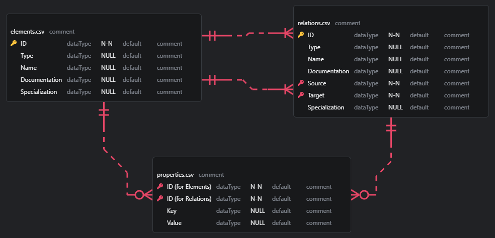

# Analysis on Archi's CSV Export File Structure

## Files Package

When exporting to CSV, there're 3 files created in the designated folder, as below:

- elements.csv
- properties.csv
- relations.csv

## Type and Name (default) in `elements.csv`

### Motivation Aspects

| Type | Name |
| --- | --- |
| Stakeholder | Stakeholder |
| Driver | Driver |
| Assessment | Assessment |
| Goal | Goal |
| Outcome | Outcome |
| Principle | Principle |
| Requirement | Requirement |
| Constraint | Constraint |
| Meaning | Meaning |
| Value | Value |

### Strategy Layer

| Type | Name |
| --- | --- |
| Resource | Resource |
| Capability | Capability |
| ValueStream | Value Stream |
| CourseOfAction | Course of Action |

### Business Layer

| Type | Name |
| --- | --- |
| BusinessActor | Business Actor |
| BusinessRole | Business Role |
| BusinessCollaboration | Business Collaboration |
| BusinessInterface | Business Interface |
| BusinessProcess | Business Process |
| BusinessFunction | Business Function |
| BusinessInteraction | Business Interaction |
| BusinessEvent | Business Event |
| BusinessService | Business Service |
| BusinessObject | Business Object |
| Contract | Contract |
| Representation | Representation |
| Product | Product |

### Application Layer

| Type | Name |
| --- | --- |
| ApplicationComponet | Application Component |
| ApplicationCollaboration | Application Collaboration |
| ApplicationInterface | Application Interface |
| ApplicationFunction | Application Function |
| ApplicationInteraction | Application Interaction |
| ApplicaitonProcess | Application Process |
| ApplicationEvent | Application Event |
| ApplicationService | Application Service |
| DataObject | Data Object |

### Technology Layer

| Type | Name |
| --- | --- |
| Node | Node |
| Device | Device |
| SystemSoftware | System Software |
| TechnologyCollaboration | Technology Collaboration |
| TechnologyInterface | Technology Interface |
| Path | Path |
| CommunicationNetwork | Communication Network |
| TechnologyFunction | Technology Function |
| TechnologyProcess | Technology Process |
| TechnologyInteraction | Technology Interaction |
| TechnologyEvent | Technology Event |
| TechnologyService | Technology Service |
| Artifact | Artifact |

### Physical (Technology) Layer

| Type | Name |
| --- | --- |
| Equipment | Equipment |
| Facility | Facility |
| DistributionNetwork | Distribution Network |
| Material | Material |

### Implementation and Migration Layer

| Type | Name |
| --- | --- |
| WorkPackage | Work Package |
| Deliverable | Deliverable |
| ImplementationEvent | Implementation Event |
| Plateau | Plateau |
| Gap | Gap |

### Other Notation

| Type | Name |
| --- | --- |
| Grouping | Grouping |
| Location | Location |

### Connection Notation

| Type | Name |
| --- | --- |
| Junction | Junction |

> [!INFO]
> Although `Junction` icon is placed in the relationship group in Archi's Palette, it is actually treated as one element from ArchiMate and put into the `elements.csv` file.

> [!NOTE]
> The `Note`, `Group` and `Connection - Connect to Note` are not ArchiMate model recognized elements, so they're not exported into the CSV `elements.csv` file

## Type of Relations in `relations.csv`

By default, there's no name assigned to the relations you connect between two elements, below table shows the Type of those relationships:

| Type |
| --- |
| CompositionRelationship |
| AggregationRelationship |
| AssignmentRelationship |
| RealizationRelationship |
| ServingRelationship |
| AccessRelationship |
| InfluenceRelationship |
| TriggeringRelationship |
| FlowRelationship |
| SpecializationRelationship|
| AssociationRelationship |

## Default Rows in `Properties.csv`

When adding `Junction`, `AccessRelationship` and `AssociationRelationship`, there're default properties added into the `properties.csv` file.

| ID | Key | Value |
| --- | --- | --- |
| Junction Element ID in `elements.csv` | Junction_Type | And |
| AccessRelationship ID in `relations.csv` | Access_Type | Write |
| AssociationRelationship ID in `relations.csv` | Directed | FALSE |

## Archi Exported CSV Files Data Model

## Rules when Importing CSV data into a model (from User Guide)

- If an imported concept or property does not exist in the target model it is created and added to the model. 
- If an imported concept or property exists in the target model (identified by the ID field) its fields are updated with any new values in the CSV file, or ignored if all the fields are the same. 
- If a concept or property is not present in the CSV file (or has been deleted from an exported CSV file), then that concept or property is not updated or deleted in the target model. This ensures that you can update or add a sub-set of objects. Concepts and properties are added or updated, never deleted. 
- If you change either of the "Source" or "Target" identifiers for a relationship in the "relations" CSV file to another existing concept's identifier these are updated in the target model. 
- You cannot change the concept "Type" field in an existing CSV file or use invalid concept types. 