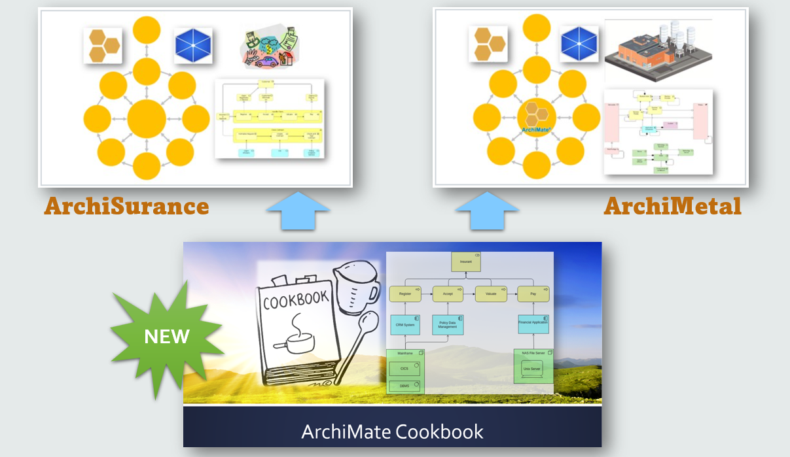

# ArchiMate-Cookbook

Modeling Practice on "[ArchiMate Cookbook](https://www.hosiaisluoma.fi/blog/archimate/)" (from Holistic Enterprise Development)

Besides my two earlier practice repository - "[ArchiSurance](https://github.com/yasenstar/ArchiSurance_Practice)" and "[ArchiMetal](https://github.com/yasenstar/ArchiMetal_Practice)" - this is the one more modeling practice using Archi (ArchiMate Modeling Tool) to give step by step guide.

The video contents are published via Udemy (and YouTube later) as one structured courseware, as below picture shown, this ArchiMate Cookbook provides more foundational view and understanding of using ArchiMate as one language, focusing the design patterns which can be independently to companies or solutions. I'd like this can be later your first course then you can go to more practical (and industrial specific) course - ArchiSurance and ArchiMetal, while, as experience Archi modeler, I believe you can also start learning from any point ;-), good luck!

Here, welcome to enroll these two ready course already:

- [Archi (ArchiMate) Modeling Practices with ArchiSurance](https://www.udemy.com/course/archi-archimate-modeling-practices-with-archisurance/?referralCode=5391DBF946B5C02FFF7D)
- [Archi (ArchiMate) Modeling Practices with ArchiMetal](https://www.udemy.com/course/archi-archimate-modeling-practices-with-archimetal/?referralCode=8D924B20ABC6D50F6EA2)

You may check [Archi](https://archimatetool.com/) time to time to get the latest version.

Enjoy your learning!
